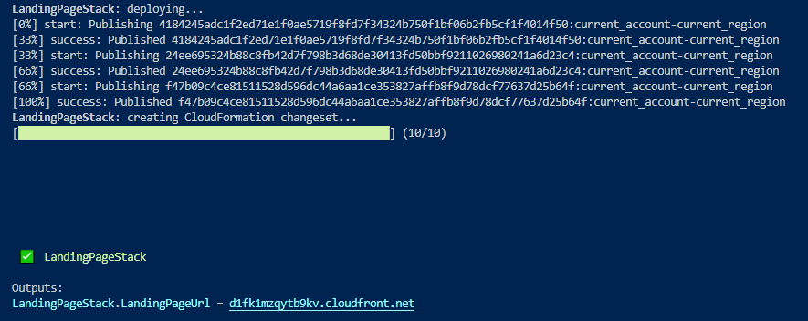

# Welcome to the Landing Page CDK app example

As described in root [README](../../README.md), this [CDK](https://docs.aws.amazon.com/cdk/latest/guide/apps.html) app deploys a static web site. The example demonstrates how to deploy on the developer environment (basically the Dev account) created by the [SDLC Organization CDK app](../1-SDLC-organization/README.md).

## Under the hood

This CDK app comes with the **LandingPageStack** which deploys your static web site and the required related AWS resources. It instanciates the following resources:
* An S3 Bucket configured to host a static web site with public access blocked
* A CloudFront Distribution
* An Origin Access Identity that allows CloudFront to access and serve the content of the S3 Bucket

The CDK app source code is in the `source/2-landing-page/cdk` folder. 

The **LandingPageStack** assumes that the content of your static web site is stored in the `source/2-landing-page/www` folder. Right now, it is a basic index.html file but it could be a more sophisticated static web site containing image, css and js files among others.


## Deployments

### Prerequisites

* A [GitHub](https://github.com) account
* [npm](https://npmjs.org) and [AWS CLI v2](https://docs.aws.amazon.com/cli/latest/userguide/install-cliv2.html) installed
* A SDLC Organization deployed with the [SDLC Organization CDK app](../1-SDLC-organization/README.md)

### Fork and clone the repository if not done previously

1. Fork the repository on your GitHub account by clicking [here](https://github.com/aws-samples/aws-bootstrap-kit-examples/fork).

2. Clone the repository locally:
    ```
    git clone https://github.com/<YOUR_GITHUB_ALIAS>/aws-bootstrap-kit-examples
    ```

### Install dependencies

1. Go to the *2-landing-page* folder

    ```
    cd source/2-landing-page/cdk
    ```

1. Install dependencies

    ```
    npm install
    ```

### Deploy the **LandingPageStack**

You can deploy the **LandingPageStack** to test the static web site into your developer environment (the Dev account).

1. Build the CDK application
    ```
    npm run build
    ```

1. Deploy the **LandingPageStack** by deploying it directly to the Dev account by using the *dev* profile you've configured when you've deployed the [SDLC Organization CDK app](../1-SDLC-organization/README.md)
    ```
    cdk deploy --profile dev
    ```

    > If you get the error message *Unable to resolve AWS account to use. It must be either configured when you define your CDK or through the environment*, you may need to refresh your SSO credentials by running the SSO login command described [here](../1-SDLC-organization/README.md#cdk-and-sso) to set up your dev profile with developer account credentials.

1. Retrieve the CloudFormation ouput called *LandingPageStack.LandingPageUrl* to navigate to your landing page

    

### Destroy the **LandingPageStack**

You can easily destroy the **LandingPageStack** and free up the deployed AWS resources on the Dev account:
```
cdk destroy --profile dev
```

### Next

You can jump to the [Landing Page with Pipeline CDK app example](../3-landing-page-cicd/README.md) to learn how to set up a CI/CD pipeline to deploy this stack on the Staging and Prod environment.

